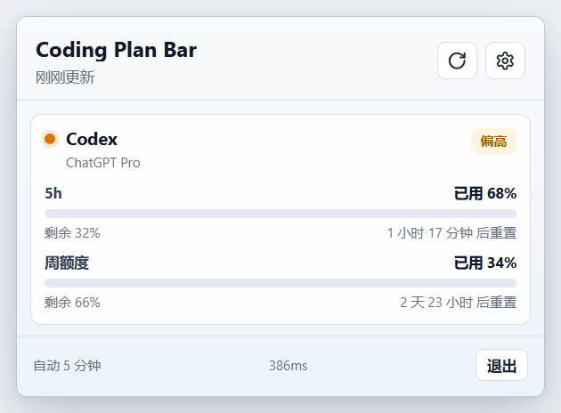
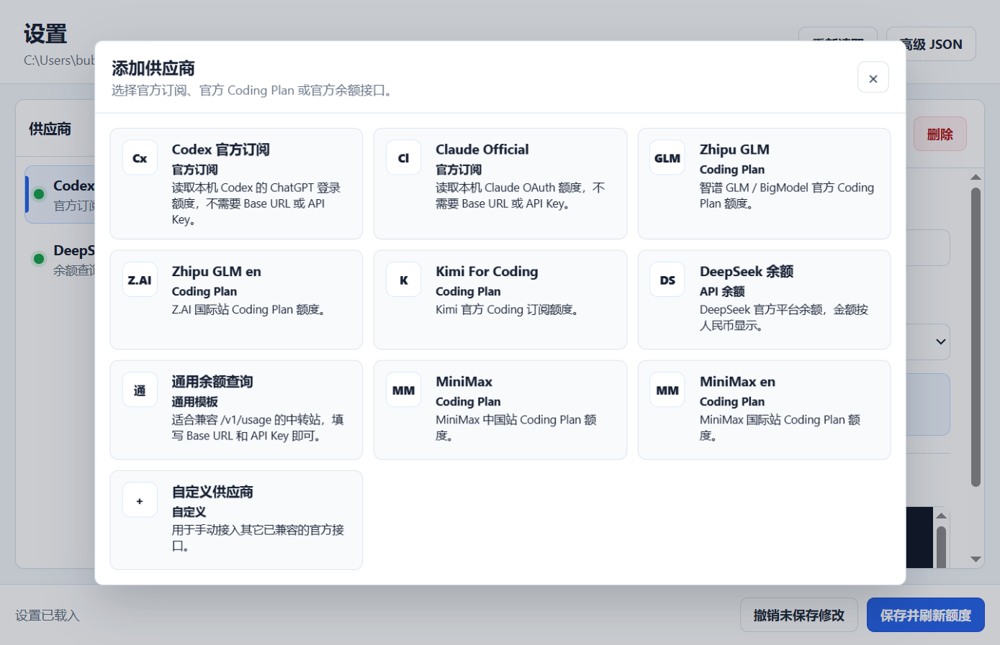

# Coding Plan Bar

中文 | [English](README_EN.md)

一个轻量的 Windows 托盘额度监控工具，用于集中查看 Codex、Claude、主流 Coding Plan 和 API 余额。



## 功能

- 常驻 Windows 系统托盘，鼠标悬停或点击即可查看额度。
- 展示 5 小时限额、周限额、重置倒计时和账户余额。
- 供应商不超过 3 个时自动适配窗口高度，超过 3 个时固定高度并滚动。
- 图形化添加、编辑、启用或停用供应商，无需手动修改 JSON。
- 默认仅启用 Codex，其他供应商由用户按需添加。
- 支持通用 `/v1/usage` 余额查询模板。
- DeepSeek 人民币余额使用 `￥` 显示。



## 安装

前往 [Releases](https://github.com/bubble0462/coding-plan-bar/releases/latest) 下载最新的 Windows 安装包：

```text
Coding Plan Bar-Setup-0.3.7-x64.exe
```

安装前请先退出正在运行的旧版本。安装向导支持选择安装目录，包括 D 盘。升级安装不会删除用户配置。

## 使用

1. 启动应用后，在系统托盘找到 Coding Plan Bar 图标。
2. 悬停或单击图标打开额度面板。
3. 点击齿轮进入设置。
4. 点击“添加”，选择供应商并填写需要的 API Key 或请求地址。
5. 点击“保存并刷新额度”。

用户配置保存在：

```text
%APPDATA%\Coding Plan Bar\config.json
```

### 检查与安装更新

1. 打开设置，点击左侧栏底部的「关于与更新」。
2. 点击「检查更新」，应用会请求 GitHub Releases 获取最新版本。
3. 发现新版本后，点击「下载更新」并在下载完成后点击「安装更新」，会启动下载好的安装程序。
4. 也可以点击「手动下载」打开 GitHub Release 页面自行下载。

默认开启「启动时自动检查更新」：应用启动时只在后台检查一次，发现新版本会在导航项提示，**不会自动下载或安装**，需要你手动确认。可在「关于与更新」页关闭该开关，关闭后重启应用不会再主动请求更新。

## 支持的额度来源

- 官方订阅：Codex、Claude。
- Coding Plan：Kimi For Coding、Zhipu GLM、MiniMax，以及兼容的 ZenMux 格式。
- API 余额：DeepSeek、Kimi/Moonshot、OpenRouter、SiliconFlow。
- 通用余额：依次尝试 `{baseUrl}/v1/usage`、`{baseUrl}/usage` 和完整 `baseUrl`。

通用余额模板使用以下请求头：

```http
Authorization: Bearer <API_KEY>
Accept: application/json
```

可识别 `remaining`、`balance`、`available_balance`、`quota.remaining`、`data.remaining`、`data.balance` 等常见字段。默认货币单位为 USD；响应包含 `unit` 或 `currency` 时会使用响应值。

## 本地开发

需要 Node.js 和 npm：

```powershell
npm install
npm run dev
```

检查与打包：

```powershell
npm run check
npm run smoke
npm run dist
```

安装包输出到 `release/`。

## 安全说明

- API Key 保存在当前 Windows 用户的配置目录中，不会上传到项目仓库。
- 建议优先使用环境变量配置 API Key。
- 部分额度接口并非公开稳定 API，供应商变更接口后可能需要更新适配。
- 使用中转站时，请自行确认其可信度以及 API Key 的使用范围。
- 更新功能只从本仓库 `bubble0462/coding-plan-bar` 的 GitHub Release 读取，只接受 Windows x64 的 NSIS 安装包；安装包先写入临时路径，下载完成且大小正常后才会被标记为可安装。

## 致谢

项目设计和供应商适配思路参考了 [codexbar](https://github.com/iamzjt-front-end/codexbar) 与 [cc-switch](https://github.com/farion1231/cc-switch)。

## License

[MIT](LICENSE)
