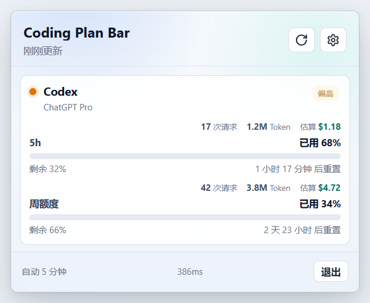
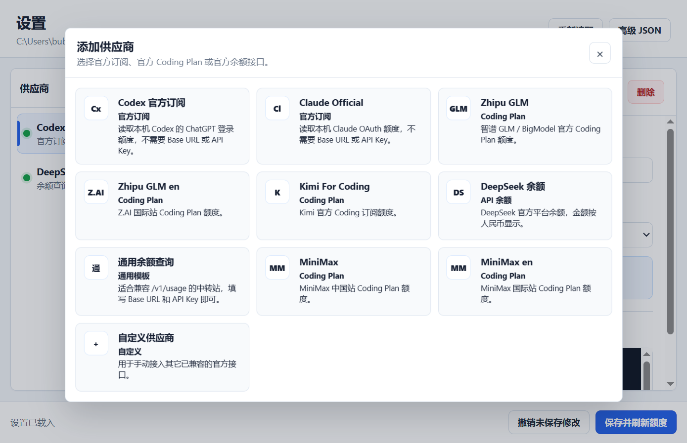

# Coding Plan Bar

中文 | [English](README_EN.md)

一个轻量的 Windows 托盘额度监控工具，用于集中查看 Codex、Claude、主流 Coding Plan 和 API 余额。



## 功能

- 常驻 Windows 系统托盘，鼠标悬停或点击即可查看额度。
- 展示 5 小时限额、周限额、重置倒计时和账户余额。
- 按额度周期统计本机请求数、Token 数量，并根据实际模型公开价格估算美元成本。
- 设置页「Agent 用量」：可在 Codex 与 Claude Code 之间切换，统计今天、最近 7 天和最近 30 天的请求、Token、会话和模型费用。
- 余额卡可显示接口返回的今日请求数、Token 与消费；DeepSeek 使用本地日志显示近 7 天统计。
- 弹窗分「总览 / 详情」两级：总览以紧凑行展示各家剩余额度与风险状态（多档位供应商并排显示各档剩余），点击行进入供应商详情；顶部选择器可切换，选择会持久保存。
- GLM 详情展示今日调用、Token（自然日口径）、近 24 小时折线与 MCP 月度额度；DeepSeek 详情可选配置平台 Token，展示本月费用、Token、缓存命中明细、逐日费用折线与峰谷时段提示。DeepSeek 高峰时段为北京时间 09:00–12:00、14:00–18:00，其余为空闲 5 折时段；该提示不参与费用重算。
- 供应商不超过 6 个时自动适配窗口高度，超过 6 个时固定高度并滚动。
- 图形化添加、编辑、启用或停用供应商，无需手动修改 JSON。
- 从供应商左侧拖拽手柄调整顺序，保存后额度面板同步采用新顺序。
- 额度面板卡片左侧也可直接拖拽排序，顺序会立即写回设置。
- Grok/SuperGrok 支持 Grok Build CLI、Web Billing 回退、月度积分和按量付费状态。
- 支持 Qwen（阿里百炼）Coding Plan（5 小时/周/月额度，DashScope API Key）与 Kimi 凭据自动复用（已登录 Kimi Code CLI 时无需 API Key）。
- 额度系统通知：档位越过 80%/95%、周额度等窗口重置、供应商查询失败时发送 Windows 通知（可在设置中开关）。
- 自适应刷新：临近额度重置或检测到本机 agent 运行时自动加密轮询，平时保持低频节省资源。
- 添加供应商采用左右分栏选择器：左侧分类分组，右侧预览所需凭据与环境变量；编辑器内置连接测试（连通性 + 可用模型列表）。
- 默认仅启用 Codex，其他供应商由用户按需添加。
- 支持通用 `/v1/usage` 余额查询模板。
- DeepSeek 人民币余额使用 `￥` 显示。



## 安装

前往 [Releases](https://github.com/bubble0462/coding-plan-bar/releases/latest) 下载最新的 Windows 安装包：

```text
Coding Plan Bar-Setup-<版本号>-x64.exe
```

安装前请先退出正在运行的旧版本。安装向导支持选择安装目录，包括 D 盘。升级安装不会删除用户配置。

## 使用

1. 启动应用后，在系统托盘找到 Coding Plan Bar 图标。
2. 悬停或单击图标打开额度面板。
3. 点击齿轮进入设置。
4. 点击“添加”，选择供应商并填写需要的 API Key 或请求地址。
5. 点击“保存并刷新额度”。

### 设置页顶部按钮

设置页左侧“账号与供应商”标题旁有三个快捷按钮：

- **最新**：自动查找 Downloads 文件夹中最近生成的 Claude 或 CPA 账号 JSON，生成预览后导入账户。
- **导入**：打开统一导入卡片，可拖入 Claude/CPA JSON、通过文件选择器选择文件，或直接粘贴 JSON 内容；预览确认后立即加密保存账户。
- **添加**：打开供应商模板选择器，用于新增和配置供应商。这是三个按钮中唯一用于添加供应商的按钮，不负责导入账户 JSON。

“最新”和“导入”支持 Claude 与 CPA 账户 JSON。Claude 账号按邮箱更新，CPA 账号按 `accountId` 更新，不会与同邮箱的不同平台账号合并。确认导入会直接写入本机配置，无需再次点击保存。应用仅保存并使用额度查询所需的 access token，不保存 Claude refresh token、CPA session token 或 ID token；access token 使用 Windows DPAPI 加密，导入预览也不会展示凭证原文。sub2api 与 sessions.json 仍可手动导入，便于迁移已有备份。“导入账号”筛选包含 Claude、CPA 与 sub2api 账号。

应用数据默认保存在：

```text
D:\Apps\Coding Plan Bar Data
```

在安装目录 `D:\Apps\Coding Plan Bar` **旁边**，不在安装目录内部，避免升级/重装清空账号。D 盘不可用时回退到 `%APPDATA%\Coding Plan Bar`。升级时会自动迁移旧路径（`D:\Apps\Coding Plan Bar\Data`、`D:\Coding Plan Bar\Data`、`%APPDATA%`），不覆盖已有文件；也可用 `CODING_PLAN_BAR_DATA_DIR` 指定其它目录。

### Token 与成本估算

- Codex 使用量读取 `%USERPROFILE%\.codex\sessions` 与 `archived_sessions` 中的本机会话 JSONL。
- 「Agent 用量」不按账号拆分，会合并默认目录与已配置 Codex 目录中的本机会话，并对 Codex 子任务/分叉会话携带的历史快照去重。
- Claude 使用量读取 `%USERPROFILE%\.claude\projects` 中的本机会话 JSONL。
- Kimi、GLM、MiniMax Coding Plan 会按日志里的模型 ID 自动归属；GLM 已覆盖 GLM-4.5/4.6/4.7、GLM-5/5-Turbo/5.1/5.2 等常用模型价格。
- Codex 已覆盖 GPT-5.6 Sol、Terra、Luna 限量预览定价；缓存读取按输入价格的 10% 计算，缓存写入按 1.25 倍输入价格计算。
- 请求数、Token 与成本分别按 5 小时和周额度的当前周期统计。缓存 Token 使用对应模型的缓存价格计算。
- `估算 $` 是按公开标准 API 单价计算的等价成本，**不是订阅账户的实际扣款或账单**。模型无法识别或没有可靠公开价格时，仍显示 Token，金额显示 `$--`。
- 兼容余额接口若返回 `usage.today`，余额卡会直接显示其中的请求数、Token 和实际消费，不再进行重复估算。

### 检查与安装更新

1. 打开设置，点击左侧栏底部的「关于与更新」。
2. 点击「检查更新」，应用会请求 GitHub Releases 获取最新版本。
3. GitHub Release 返回有效 SHA256 时，可以点击「下载更新」并在下载完成后点击「安装更新」。
4. 也可以点击「手动下载」打开 GitHub Release 页面自行下载。

当 GitHub API 不可用或 Release 缺少 SHA256 时，应用只提示新版本并提供手动下载入口，不会下载或启动未校验的安装包。

默认开启「启动时自动检查更新」：应用启动时只在后台检查一次，发现新版本会在导航项提示，**不会自动下载或安装**，需要你手动确认。可在「关于与更新」页关闭该开关，关闭后重启应用不会再主动请求更新。

## 支持的额度来源

- 官方订阅：Codex、Claude、Grok/SuperGrok。
- Coding Plan：Kimi For Coding、Zhipu GLM、MiniMax，以及兼容的 ZenMux 格式。
- API 余额：DeepSeek、Kimi/Moonshot、OpenRouter、SiliconFlow。
- 通用余额：依次尝试 `{baseUrl}/v1/usage`、`{baseUrl}/usage` 和完整 `baseUrl`。

通用余额模板使用以下请求头：

```http
Authorization: Bearer <API_KEY>
Accept: application/json
```

可识别 `remaining`、`balance`、`available_balance`、`quota.remaining`、`data.remaining`、`data.balance` 等常见字段。默认货币单位为 USD；响应包含 `unit` 或 `currency` 时会使用响应值。

## 本地开发

需要 Node.js 和 npm：

```powershell
npm install
npm run dev
```

检查与打包：

```powershell
npm run check
npm run smoke
npm run dist
```

安装包输出到 `release/`。

## 安全说明

- API Key 和应用内导入的 OAuth token 使用 Electron safeStorage/Windows DPAPI 加密，只能由当前 Windows 用户解密，不会上传到项目仓库。
- Token 统计只读取本机会话文件中的时间、模型和 usage 字段，不读取或上传对话正文。
- 建议优先使用环境变量配置 API Key。
- 部分额度接口并非公开稳定 API，供应商变更接口后可能需要更新适配。
- 使用中转站时，请自行确认其可信度以及 API Key 的使用范围。
- 更新功能只从本仓库 `bubble0462/coding-plan-bar` 的 GitHub Release 读取，只接受带 SHA256 的 Windows x64 NSIS 安装包；下载完成后会同时校验大小与 SHA256。

- Agent 用量缓存只保存聚合后的统计快照（最大 512 KB），不复制或上传原始会话、聊天内容；应用会每日清理过期临时文件、保留 14 天/10 MB 以内的应用日志，并清理 Electron HTTP 缓存。
## 致谢

项目设计和供应商适配思路参考了 [codexbar](https://github.com/iamzjt-front-end/codexbar)、[CodexBar](https://github.com/steipete/CodexBar) 与 [cc-switch](https://github.com/farion1231/cc-switch)。

## License

[MIT](LICENSE)
